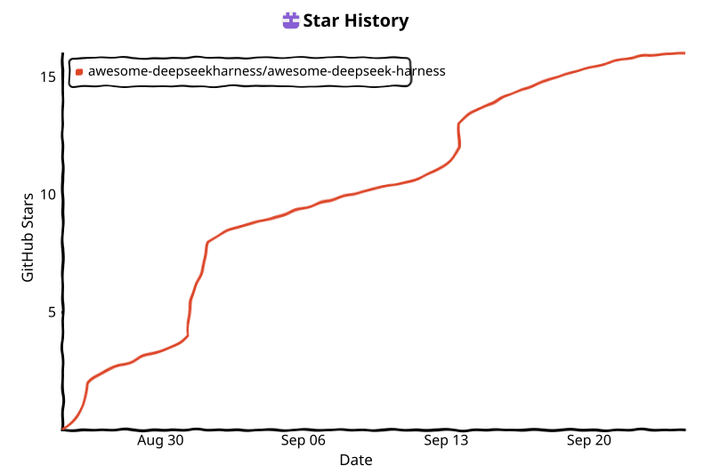

# Awesome DeepSeek Harness (dsh)

**Everything is a Plugin.**

A curated collection of the best plugins, tools, skills, and resources built for [DeepSeek Harness](https://github.com/deepseek-ai/deepseek-harness) (`dsh`) — the open-source agent harness from DeepSeek AI, powered by [Cordis](https://github.com/cordiverse/cordis).

English | [中文](README.zh.md)

[Official Repo](https://github.com/deepseek-ai/deepseek-harness) · [Official Site](https://deepseek.com/harness) · [Discord](https://discord.gg/Ycq5dCaS4) · [Discussions](https://github.com/deepseek-ai/deepseek-harness/discussions) · [dsh-plugin Topic](https://github.com/topics/dsh-plugin) · [Official Tracker](https://github.com/awesome-deepseekharness/deepseek-official-tracker)

  
  
  
  
  

> ⭐ **Found this list useful? Star it — it takes 2 seconds, and it happens to be the #1 way to help others discover dsh plugins.**
> Your ⭐ is not just a bookmark — it boosts visibility for every plugin author on this list (GitHub ranks starred lists higher) and notifies you when we add 2–3 new plugins each week. Currently **3 → 100 stars is our first milestone (97 to go)** — early stargazers shape what gets curated next. Be one of the first 100.
>
> **Share & spread:** if you built or love a plugin here, one share = 10× discoverability. [Share on X](https://twitter.com/intent/tweet?text=Awesome%20DeepSeek%20Harness%20%E2%80%94%20Everything%20is%20a%20Plugin%20%E2%9A%A1%20Curated%20dsh%20plugins%2C%20tools%20%26%20skills%20for%20%40deepseek_ai%20harness&url=https://github.com/awesome-deepseekharness/awesome-deepseek-harness&hashtags=dsh,deepseek,opensource) · [Share on Reddit](https://www.reddit.com/submit?url=https://github.com/awesome-deepseekharness/awesome-deepseek-harness&title=Awesome%20DeepSeek%20Harness%20%E2%80%94%20curated%20plugins%20%26%20skills) · [Discuss on Discord](https://discord.gg/Ycq5dCaS4) · [Copy link](https://github.com/awesome-deepseekharness/awesome-deepseek-harness)
>
> *Tip: READMEs with a clear demo tend to get more attention. Adding `dsh-plugin` helps with discovery, and starring the list keeps you in the loop for new additions.*

## What is dsh?

DeepSeek Harness is DeepSeek AI's open-source agent harness. Its core philosophy is **everything is a plugin**: the model adapter, tool registry, session log, permission model, and even the agent loop itself are replaceable plugins — "no privileged core to patch." The runtime is built on [Cordis](https://github.com/cordiverse/cordis) (a meta-framework of spatiotemporal composability).

| Mode | Description |
| --- | --- |
| **Standard** | Full coding agent: file editing, shell, file & web search, skills, planning, goals, subagents, workflows |
| **Code** | All of Standard, plus tools exposed through the Code Mode SDK so the model can combine multi-step operations in one TypeScript program |
| **Minimal** | Two-tool coding agent (persistent bash + str_replace_editor) for benchmarking models |
| **Creator** | Runtime inspection, in-memory plugin experiments, and composing new modes — for authoring custom agent presets |

> ⚠️ **Developer Preview**: the official release warns that compatibility-breaking changes are coming. APIs and plugin contracts may change.

---

## 📦 Plugins (The Core)

> Publishing your own plugin? Tag your repository with the [`dsh-plugin`](https://github.com/topics/dsh-plugin) topic for discoverability.

### 🛍️ Marketplaces & Discovery

| Project | Description | ⭐ |
| --- | --- | --- |
| [dsh-market/dsh-market](https://github.com/dsh-market/dsh-market) | The plugin market inside DeepSeek Harness — browse, search, one-click install | 156 |
| [bradeGithub/DSH-Plugins-Marketplace](https://github.com/bradeGithub/DSH-Plugins-Marketplace) | Browse, install & update all GitHub `dsh-plugin` plugins in the DSH Web GUI | 46 |
| [Nagi-ovo/dsh-find-plugins](https://github.com/Nagi-ovo/dsh-find-plugins) | A DSH skill that finds, installs, and verifies GitHub plugins | 78 |
| [AdamPlatin123/awesome-dsh-plugins](https://github.com/AdamPlatin123/awesome-dsh-plugins) | Radar index repo that auto-scans dsh plugin candidates | 908 |
| [LaplaceYoung/oh-my-dsh](https://github.com/LaplaceYoung/oh-my-dsh) | 700+ plugins registered only through extension seams — no agent-loop modification | 45 |

### 👁️ Vision

The hottest category — giving text-only models "eyes."

| Project | Description | ⭐ |
| --- | --- | --- |
| [liustack/modlens](https://github.com/liustack/modlens) | The first vision plugin for DSH: paste an image, get structured JSON evidence (OCR, layout, semantics) | 1525 |
| [Anionex/dsh-vision-toolkit](https://github.com/Anionex/dsh-vision-toolkit) | Intent-aware image Q&A, long-screenshot OCR, UI restoration, grounding, pixel diff, Artifacts, Web UI | 384 |
| [Anionex/agent-vision-toolkit](https://github.com/Anionex/agent-vision-toolkit) | Vision toolkit & skills for text-only LLMs: multi-image, Q&A, frontend UI restoration, GUI automation | 871 |
| [ysr666/dsh-vision-router](https://github.com/ysr666/dsh-vision-router) | Built-in free vision chain (no key) + pixel-level vision tools; one-command install, no Python | 94 |
| [QwenLM/Qwen-MM-Plugins](https://github.com/QwenLM/Qwen-MM-Plugins) | Make any agent harness multimodal-native (cross-harness) | 2549 |

### 🌐 Web & Browser

| Project | Description | ⭐ |
| --- | --- | --- |
| [liustack/modsearch](https://github.com/liustack/modsearch) | Web plugin for DSH: ask the web or X, get structured JSON evidence (search, fetch, citations) | 98 |
| [Lum1104/dsh-browser](https://github.com/Lum1104/dsh-browser) | Chrome sidebar extension that lets DSH operate your browser directly — no vision required | 114 |
| [taxueseek/argo](https://github.com/taxueseek/argo) | Agent search tool: Chinese/English/academic/code/shopping/finance/news/encyclopedia | 73 |

### 🧠 Memory

| Project | Description | ⭐ |
| --- | --- | --- |
| [csyangwen/dsh-memory-evolve](https://github.com/csyangwen/dsh-memory-evolve) | Cross-session long-term memory + background self-evolution: 5-track memory, git-branch awareness, skill self-evolution | 68 |
| [adoresever/graph-memory](https://github.com/adoresever/graph-memory) | Knowledge-graph memory: extract triples from conversations, compress context 75%, reuse experience across sessions | 513 |
| [mnemon-dev/mnemon](https://github.com/mnemon-dev/mnemon) | LLM-supervised persistent memory — graph recall, cross-session knowledge, single binary; works with DSH/Claude Code/OpenClaw | 443 |
| [tinqiao-oss/engramory](https://github.com/tinqiao-oss/engramory) | Portable memory protocol for AI agents: load as standing rules, curation discipline + reference spec | 152 |
| [text2future/flowix](https://github.com/text2future/flowix) | Notes for you, memory for your agents | 280 |
| [Ariestar/sivtr](https://github.com/Ariestar/sivtr) | A unified agent memory workspace for human and agent | 131 |

### 🎨 Web UI, Skins & Desktop Pets

| Project | Description | ⭐ |
| --- | --- | --- |
| [zhu1090093659/dsh-web-ui](https://github.com/zhu1090093659/dsh-web-ui) | Plugin & skin collection for the DSH Web UI: task board, git graph, right-side panel, remote mobile UI, pet, live token stats, skin center | 2250 |
| [Small-tailqwq/dsh-deep-whale](https://github.com/Small-tailqwq/dsh-deep-whale) | "Whale girl" skin series for DSH Web (maid-atelier) | 742 |
| [vlln/whale-girl](https://github.com/vlln/whale-girl) | Desktop pet plugin for the DSH Web GUI (QQ-pet style): floating, draggable, feedable | 151 |
| [omdsh-dev/DSH-better-sidebar](https://github.com/omdsh-dev/DSH-better-sidebar) | A complete sidebar workbench: file rendering/editing, terminal, Git, subagents, third-party pages | 911 |
| [omdsh-dev/dsh-annotation](https://github.com/omdsh-dev/dsh-annotation) | Select-to-annotate plugin: select text → annotate → send with message | 45 |
| [Nagi-ovo/dsh-ads](https://github.com/Nagi-ovo/dsh-ads) | Turn DSH into a 2005-era portal: parody ads, fake games, and popups | 371 |
| [Nagi-ovo/dsh-visualize](https://github.com/Nagi-ovo/dsh-visualize) | Render interactive visualization cards inside DSH conversations | 88 |
| [omdsh-dev/dsh-genui](https://github.com/omdsh-dev/dsh-genui) | GenUI: interactive UI components inline in replies (layout, charts, forms, mermaid, 3D) + action event loop | 87 |
| [ZSeven-W/dsh-openpencil](https://github.com/ZSeven-W/dsh-openpencil) | OpenPencil design preview & editing plugin for DSH | 71 |
| [zizaiwo/dsh_plugins](https://github.com/zizaiwo/dsh_plugins) | Sidebar session categories for dsh Web UI: zero-config takeover of official workspace browser, organize sessions by custom folders (drag & drop, in-category creation, per-workspace isolation) | 0 |
| [lcsdg/dsh-quick-prompts](https://github.com/lcsdg/dsh-quick-prompts) | Quick-prompts bar above composer: per-category snippet chips, orange {{placeholder}} highlighting, two-column management, per-session category memory | 0 |
| [Moonshile/moonshile-dsh-plugins](https://github.com/Moonshile/moonshile-dsh-plugins) | Re-sorts sidebar workspaces by last activity once per day; stable order within the day | 0 |
### 🖥️ TUI & Desktop

| Project | Description | ⭐ |
| --- | --- | --- |
| [ccch1mneyyy/dsh-TUI](https://github.com/ccch1mneyyy/dsh-TUI) | Claude Code-style full-screen terminal plugin: pixel-whale top bar, streaming thoughts, double-Esc rollback, TPS gauge | 1047 |
| [huiliyi37/dsh-tianshu-tui](https://github.com/huiliyi37/dsh-tianshu-tui) | Interactive terminal UI + harness workflows: adds TDD, evidence gates, vision modules | 143 |
| [anywhere-labs/deepseek-harness-desktop](https://github.com/anywhere-labs/deepseek-harness-desktop) | A modern desktop experience for the DSH ecosystem | 3596 |
| [hust-open-atom-club/oh-dsh](https://github.com/hust-open-atom-club/oh-dsh) | Community DSH distribution: unified TUI, desktop, and Web UI with layered install | 176 |
| [vibeinging/deepseek-harness-desktop-app](https://github.com/vibeinging/deepseek-harness-desktop-app) | Local AI desktop workspace: sessions, projects, files, web research, plugins, Office artifacts | 111 |
| [ChisaAlter/Deepseek-Harness-Desktop](https://github.com/ChisaAlter/Deepseek-Harness-Desktop) | Electron desktop shell for the DSH web UI, with themes & backgrounds | 74 |
| [Ruler4396/dsh-launcher](https://github.com/Ruler4396/dsh-launcher) | Lightweight Windows launcher: silent autostart + WebView2 window | 87 |
| [Jensen-Yao/dsh-plus-plus](https://github.com/Jensen-Yao/dsh-plus-plus) | Windows WPF desktop console for `dsh web`: one-click start/stop, phone URL over Wi-Fi/domain/Tailscale, firewall rule, storage locations, live logs, dark/light themes | 0 |

### 🧩 Tools, Workflows & Presets

| Project | Description | ⭐ |
| --- | --- | --- |
| [xiaobright/dsh-anchored-standard](https://github.com/xiaobright/dsh-anchored-standard) | Two-phase DSH preset: Minimal-aligned bootstrap, then full Standard tools | 1336 |
| [icetomoyo/dsh_workflow](https://github.com/icetomoyo/dsh_workflow) | Upgrade one-shot multi-agent scheduling into a generatable, savable, governable workflow layer | 55 |
| [liceses/dsh-gitbash-preset](https://github.com/liceses/dsh-gitbash-preset) | One-click "Minimal (Git Bash)" preset so Minimal mode works on Windows | 48 |
| [omdsh-dev/dsh-at-file](https://github.com/omdsh-dev/dsh-at-file) | Codex-style `@file` mentions: search workspace files in the composer and attach contents | 169 |
| [omdsh-dev/dsh-open-in-vscode](https://github.com/omdsh-dev/dsh-open-in-vscode) | Open DSH workspace directories in VS Code directly from the web GUI | 41 |
| [omdsh-dev/dsh-notification](https://github.com/omdsh-dev/dsh-notification) | Desktop notifications for turn completions, with per-outcome and keyword rules | 43 |
| [pitetow/dsh-notify-on-complete](https://github.com/pitetow/dsh-notify-on-complete) | Zero-dependency desktop notifications: run completion, questions, approvals | 4 |
| [hxyz486/dsh-archived-conversations](https://github.com/hxyz486/dsh-archived-conversations) | View, restore & delete archived conversations in DSH settings | 6 |
| [Anionex/dsh-turn-rewind](https://github.com/Anionex/dsh-turn-rewind) | Rewind conversation & workspace state, powered by a persistent Change Ledger | 50 |
| [william-jin-cmu/dsh-evolve](https://github.com/william-jin-cmu/dsh-evolve) | Self-evolving plugin: hot-mount/remove Cordis plugins in-session, auto-restore on restart | 5 |
| [Francis-Xavier-code/dsh-balance-plugin](https://github.com/Francis-Xavier-code/dsh-balance-plugin) | DeepSeek balance monitoring & usage stats + official top-up entry | 7 |
| [Cassius0924/dsh-usage-dashboard](https://github.com/Cassius0924/dsh-usage-dashboard) | DeepSeek quota & usage dashboard | 4 |
| [dustinmoon78/dsh-usage-stats](https://github.com/dustinmoon78/dsh-usage-stats) | DSH usage stats: aggregated token usage (overview/by-model/by-day) + pricing & cost estimate in Settings | 0 |
| [null5069/dsh-better-stats](https://github.com/null5069/dsh-better-stats) | Enhanced DSH Web composer stats strip: official CNY pricing (peak/off-peak, per-model), real-time settlement, live LLM/tool timers, provider balance, budget alerts | 2 |
| [NanmiCoder/dsh-agent-teams](https://github.com/NanmiCoder/dsh-agent-teams) | AgentTeams multi-agent collaboration plugin for DSH | 290 |
| [btspoony/mstar-harness](https://github.com/btspoony/mstar-harness) | Skill-driven harness/loop engineering workflow agent plugin | 43 |
| [weshopai/weshop-dsh-plugin](https://github.com/weshopai/weshop-dsh-plugin) | Native WeShop plugin: infinite canvas with infinite creative skills | 6 |
| [morluto/jacobian](https://github.com/morluto/jacobian) | Pure mathematics for agents: search examples/counterexamples, compute exactly, verify | 43 |
| [thedeveloper256/dsh-model-router](https://github.com/thedeveloper256/dsh-model-router) | Role-based model routing: planner (root agent) on deepseek-v4-pro, delegated executor subagents on deepseek-v4-flash; ships a prompt section + `pro-flash-routing` skill | 1 |
| [zhengjy01/dsh-task-dispatcher](https://github.com/zhengjy01/dsh-task-dispatcher) | TickTick daily task dispatcher: interval pulls of todays due tasks, change-aware flomo+macOS notifications, optional auto-execute in headless sessions, worker workspace selection, web task board | 0 |
| [PerryLink/dsh-auto-review](https://github.com/PerryLink/dsh-auto-review) | Second-model auto-review for DSH approval requests: a read-only reviewer subagent returns structured allow/deny verdicts with reasons, fail-closed by default and auditable from the session log. Installable via `dsh plugin --profile web add dsh-auto-review` | 119 |
| [PerryLink/dsh-session-sync](https://github.com/PerryLink/dsh-session-sync) | Cross-device session sync for DeepSeek Harness: a dedicated git mirror of the session store with append-only keep-both conflict resolution that never loses a turn. | 4 |

### 📚 Skills

| Project | Description | ⭐ |
| --- | --- | --- |
| [titanwings/colleague-skill](https://github.com/titanwings/colleague-skill) | Digital Life 1.0: transforming cold farewells into warm skills | 22228 |
| [tt-a1i/archify](https://github.com/tt-a1i/archify) | Beautiful, verifiable architecture/workflow/sequence/data-flow/lifecycle diagrams — self-contained HTML with motion | 12744 |
| [hyhmrright/brooks-lint](https://github.com/hyhmrright/brooks-lint) | AI code reviews grounded in 12 classic engineering books: decay-risk diagnostics, 6 analysis modes | 1329 |
| [GanyuanRan/Aegis](https://github.com/GanyuanRan/Aegis) | Make coding agents architecture-aware: baseline-first, evidence-verified, drift-checked | 1013 |
| [superdesigndev/superdesign-skill](https://github.com/superdesigndev/superdesign-skill) | The design skill for coding agents: stop shipping AI-slop UI, ship shippable frontends | 411 |
| [yogsoth-ai/de-anthropocentric-research-engine](https://github.com/yogsoth-ai/de-anthropocentric-research-engine) | 900+ pure-markdown research skills: 4-layer hierarchy, 9 composable packages, 6 MCP integrations | 378 |
| [Minara-AI/minara-skills](https://github.com/Minara-AI/minara-skills) | Trading skills to make your agent earn for you | 324 |
| [linhay/harmony-next.skills](https://github.com/linhay/harmony-next.skills) | Expert guidance for HarmonyOS NEXT (API 12+) development | 321 |
| [alaliqing/claude-paper](https://github.com/alaliqing/claude-paper) | Cross-agent research paper toolkit: summaries, deep study, code demos, local web viewer | 294 |
| [dhicoc/dsh-reverse-skill](https://github.com/dhicoc/dsh-reverse-skill) | 85 SKILL.md reverse-engineering & security research skill pack (Cordis plugin) | 10 |
| [Lyn-77/ProMentor](https://github.com/Lyn-77/ProMentor) | AI coding mentor: architecture scan, laddered chapters, hand-written core logic, auto-grading | 54 |
| [Jayden-X-L/forkprobe](https://github.com/Jayden-X-L/forkprobe) | Compare multiple skills on the same task and pick the winner | 65 |
| [Mikuzjc/dsh-office-for-mso](https://github.com/Mikuzjc/dsh-office-for-mso) | DSH <-> Microsoft Office bridge skill: control open Word/Excel/PowerPoint via Office add-in (33 actions, AI-orchestrated) | 1 |
| [suyukun/dsh-tech-selection](https://github.com/suyukun/dsh-tech-selection) | Model-agnostic technology-selection research protocol for any AI agent (DSH/Claude/Cursor/Codex): T1-T6 source tiers, quality gates, quantified trade-offs, traceable verdicts | 0 |
| [morluto/rea](https://github.com/morluto/rea) | Reverse engineer anything with agents, from app behavior down to native binaries | 322 |

### 🚀 Apps & Runtimes Built on DSH

| Project | Description | ⭐ |
| --- | --- | --- |
| [Devin-AXIS/iPolloWork](https://github.com/Devin-AXIS/iPolloWork) | Self-evolving agent runtime AI workspace, integrating DSH subagent delegation & both plugin ecosystems | 4067 |
| [whiteguo233/OpenBiliClaw](https://github.com/whiteguo233/OpenBiliClaw) | Local-first content discovery agent: Bilibili/Xiaohongshu/Douyin/YouTube/X/Zhihu/Reddit/Weibo (DSH plugin supported) | 2457 |
| [sandbaseai/sandbase-harness](https://github.com/sandbaseai/sandbase-harness) | Open-source CMA-compatible agent runtime: MCP tools, sandboxed sessions, audit & replay; includes a native DSH bundle | 581 |
| [hellowind777/helloagents](https://github.com/hellowind777/helloagents) | An autonomous senior AI partner that keeps working until implementation & verification complete | 680 |
| [yejiming/MuseAI](https://github.com/yejiming/MuseAI) | Create AI characters, enter story worlds (DSH plugin supported) | 548 |
| [ctxrs/ctx](https://github.com/ctxrs/ctx) | Instant recall for coding agents: search agent session history — git blame for sessions | 1029 |
| [strukto-ai/mirage](https://github.com/strukto-ai/mirage) | The world's first unified virtual filesystem for AI agents | 3430 |
| [junhoyeo/tokscale](https://github.com/junhoyeo/tokscale) | Track token usage across AI coding agents from your terminal; global leaderboard | 4963 |
| [xiufengsun/TokenTracker](https://github.com/xiufengsun/TokenTracker) | Local-first token & cost tracker for 31 coding tools incl. DSH, with native apps | 1315 |
| [JingbiaoMei/Tokdash](https://github.com/JingbiaoMei/Tokdash) | Visualization & analytics for sessions and quota usage: heatmaps, cost tracking | 54 |
| [EthanYoQ/Invoice-Downloader](https://github.com/EthanYoQ/Invoice-Downloader) | DSH bundle for local IMAP invoice download, OCR, archival, and Excel reimbursement summaries | 141 |

---

## 🧱 Core Infrastructure

| Project | Description | ⭐ |
| --- | --- | --- |
| [deepseek-ai/deepseek-harness](https://github.com/deepseek-ai/deepseek-harness) | Official repo: Everything is a Plugin | 104.5k |
| [cordiverse/cordis](https://github.com/cordiverse/cordis) | Meta-framework of spatiotemporal composability — the plugin runtime behind DSH | 3607 |
| [cordiverse/paper](https://github.com/cordiverse/paper) | *A Programming Paradigm for Spatiotemporal Composability* (Cordis design paper) | — |
| [@deepseek-ai/dsh](https://www.npmjs.com/package/@deepseek-ai/dsh) | Official npm package: `npx @deepseek-ai/dsh web` to launch | — |
| [create-dsh-plugin](https://www.npmjs.com/package/create-dsh-plugin) | Scaffold a DSH plugin in seconds (tool/events/webui templates + built-in verify) | — |

## 🎓 Learning & Guides

| Project | Description | ⭐ |
| --- | --- | --- |
| [Electricitysheep/dsh-handbook](https://github.com/Electricitysheep/dsh-handbook) | DSH 0-to-1 handbook: install, plugin dev, performance tuning, real cases (CN/EN PDF) | 248 |
| [pingfanfan/hello-dsh](https://github.com/pingfanfan/hello-dsh) | Zero-to-plugin tutorial "Everything is a plugin", with 22 Chinese skill examples | 45 |
| [omdsh-dev/dsh-plugin-dev](https://github.com/omdsh-dev/dsh-plugin-dev) | DSH plugin dev pitfall archive: cordis dual-copies, tsconfig tri-set, Windows junction, multi-frame zstd | 10 |
| [hikariming/dshfind](https://github.com/hikariming/dshfind) | Learn DSH principles, plugin marketplace & best practices | 76 |
| [DeepWiki: deepseek-harness](https://deepwiki.com/deepseek-ai/deepseek-harness) | Auto-generated docs for the official repo | — |
| [deepseekagent.io guide](https://deepseekagent.io/guides/deepseek-harness) | dsh install & architecture guide (community) | — |

**Official docs:** [development.md](https://github.com/deepseek-ai/deepseek-harness/blob/master/docs/development.md) · [architecture.md](https://github.com/deepseek-ai/deepseek-harness/blob/master/docs/architecture.md) · [cordis-primer](https://github.com/deepseek-ai/deepseek-harness/blob/master/docs/cordis-primer.md) · [cordis-tutorial](https://github.com/deepseek-ai/deepseek-harness/blob/master/docs/cordis-tutorial/index.md) (7 plugin tutorials) · [cookbook](https://github.com/deepseek-ai/deepseek-harness/tree/master/docs/cookbook) · [capability-seams](https://github.com/deepseek-ai/deepseek-harness/blob/master/docs/capability-seams.md)

## 🤝 Community

- [GitHub Discussions](https://github.com/deepseek-ai/deepseek-harness/discussions) — feedback & discussion
- [Discord](https://discord.gg/Ycq5dCaS4) — official DeepSeek Harness community
- [dsh-plugin topic](https://github.com/topics/dsh-plugin) — tag your plugin repo for discoverability

## 🔗 Sister Project

- [DeepSeek Official Tracker](https://github.com/awesome-deepseekharness/deepseek-official-tracker) — auto-tracked feed of DeepSeek official news, changelog, releases & npm changes (GitHub Actions)

---

## ⭐ Star History & Community Growth

<!-- star-history start -->
<picture>
  <source media="(prefers-color-scheme: dark)" srcset="assets/star-history/star-history-dark.svg">
  <source media="(prefers-color-scheme: light)" srcset="assets/star-history/star-history-light.svg">
  
</picture>
<!-- star-history end -->

> **Community momentum:** As we approach 100 stars, popular or noteworthy plugins *may* be highlighted or pinned within this list and its site (e.g., a small featured area) — no guarantees, just a way for us to gauge what the community values and keep the list fresh. [Star on GitHub](https://github.com/awesome-deepseekharness/awesome-deepseek-harness) · [Follow @deepseek_ai on X](https://x.com/deepseek_ai) · [Join Discord](https://discord.gg/Ycq5dCaS4)

Chart is self-hosted via GitHub Action (`narayann7/star-history-action`) and refreshes every 6h + on new stars. Previously used `api.star-history.com/svg` is disabled due to [GitHub stargazers API restriction](https://star-history.com/blog/github-stargazer-api-restriction). If the image is empty, wait for the first workflow run or [view interactive chart](https://star-history.com/#awesome-deepseekharness/awesome-deepseek-harness&Date).

## Contributing

Found a great project? Open a [PR](CONTRIBUTING.md) or file an issue. Criteria: DSH-related, installable & usable, with a clear purpose.

> 💡 **PR tip — get merged in <24h:** follow the new [PR template](.github/pull_request_template.md) + [CONTRIBUTING.md](CONTRIBUTING.md) checklist (bilingual entry, correct category, verified install, `dsh-plugin` topic). Well-formed PRs are auto-labelled and get priority review. If no review in 48h, feel free to friendly ping `@hdjekuue` or other maintainers in the PR.

*This list is continuously updated. Star counts as of 2026-08-15.*

## License

[CC0-1.0](LICENSE) — public domain, use freely.
